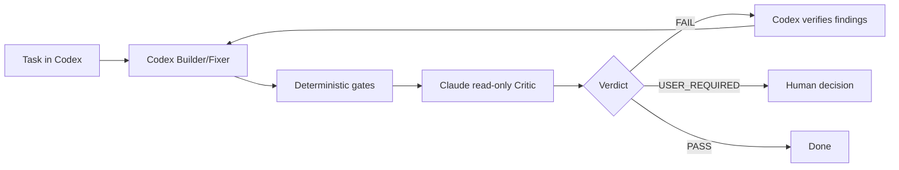

<div align="center">

# PingPong

**Cross-model development review for Codex.**  
Codex builds. Claude critiques. Deterministic gates decide.

[](https://github.com/mikhail494/PingPong/releases)
[](https://github.com/mikhail494/PingPong/actions/workflows/validate.yml)
[](LICENSE)

</div>

PingPong is a Codex skill that closes the review loop between two different models. The current Codex session remains the **Builder/Fixer**; a locally installed Claude Code CLI acts as an independent, read-only **Critic**. Codex verifies the critique instead of blindly applying it, fixes valid findings, reruns deterministic checks, and repeats until the required quality gate passes.

```text
Task in Codex
    ↓
Codex builds
    ↓
Deterministic gates
    ↓
Claude critiques
    ↓
Codex verifies findings
    ↓
fix → re-test → re-review → PASS
```

## Why

Without a second-model loop, development often becomes:

```text
Codex → manual review → corrective prompt → Codex → manual review → ...
```

PingPong turns that into a bounded workflow with explicit roles, structured verdicts, deterministic checks, and an escape hatch for ambiguity.

## Quick start

### 1. Install from GitHub

Give Codex this repository URL and ask it to install the repository globally as a skill:

> Install https://github.com/mikhail494/PingPong globally as the `pingpong` Codex skill. Verify the requirements, run PingPong doctor, and do not modify the current project.

A standard Codex skill installation is sufficient. PingPong does not require a second runtime copy in another skills directory.

### 2. Verify the critic

On the next turn, run:

```text
$pingpong self-test
```

A successful self-test reaches Claude Sonnet and returns:

```text
CLAUDE_CRITIC_OK
```

### 3. Use it

```text
$pingpong <task>
```

## Modes

| Mode | Critic | Intended use |
| --- | --- | --- |
| `$pingpong <task>` | Claude Sonnet | Default development loop |
| `$pingpong final-opus <task>` | Sonnet loop + final Opus review | Important changes with bounded Opus usage |
| `$pingpong opus <task>` | Claude Opus every round | Explicit high-stakes review |
| `$pingpong self-test` | Claude Sonnet | Verify the Claude critic path |

PingPong never silently escalates from Sonnet to Opus.

## How it works



For each task PingPong:

1. captures the requested scope;
2. lets Codex implement it;
3. runs available tests, lint, type checks, builds, or project-specific gates;
4. sends the task, authoritative project specifications, Git changes, untracked text files, and gate output to Claude;
5. receives a structured `PASS`, `FAIL`, or `USER_REQUIRED` verdict;
6. requires Codex to independently verify every blocking finding;
7. fixes only findings supported by evidence;
8. repeats with hard round limits.

Deterministic correctness gates outrank both models.

## Review semantics

Claude is not the implementer and is instructed to remain read-only. Blocking findings must be tied to concrete evidence from the task, authoritative project files, actual Git changes, or deterministic gate output.

- **PASS**: no unresolved `BLOCKER` or `HIGH` findings.
- **FAIL**: at least one evidence-backed blocking issue Codex can fix from the available evidence.
- **USER_REQUIRED**: a material decision cannot be resolved without a human or domain expert.

Codex may reject a Claude finding, but only with concrete evidence.

See [docs/DESIGN.md](docs/DESIGN.md) for the full review model.

## Data boundary

PingPong invokes your locally authenticated Claude Code CLI. During a normal review, the critic can receive:

- the task text;
- selected authoritative project files such as `AGENTS.md` and strategy/rules specs;
- staged and unstaged Git diffs;
- `git status`;
- untracked **text** files, truncated to 100,000 characters per file;
- deterministic gate output.

Binary untracked content is omitted. Do not use PingPong on material you are not comfortable sending through your configured Claude Code environment.

## Requirements

- Codex with Skills support;
- Claude Code CLI available on `PATH`;
- Git;
- Python;
- a working Claude Code authentication/plan configuration.

PingPong uses the **current Codex session** as Builder. It does not spawn `codex exec` and does not require a separate Codex CLI login.

PingPong itself does not manage Claude billing or authentication. It uses whatever configuration your local Claude Code CLI is already using.

## Doctor

`doctor.ps1` performs local packaging/dependency checks and makes **no LLM request**.

From the repository or installed skill directory on Windows:

```powershell
powershell -NoProfile -ExecutionPolicy Bypass -File .\doctor.ps1
```

The doctor verifies required files and local commands. It deliberately does not claim Claude authentication is valid because doing so would require an actual model request.

## Safety model

PingPong is deliberately asymmetric:

- Codex is the only Builder/Fixer.
- Claude is the independent read-only Critic.
- deterministic gates outrank model opinions;
- unrelated user work must not be reset, reverted, stashed, or deleted;
- missing domain semantics must not be invented;
- ambiguous material decisions stop with `USER_REQUIRED`.

This makes the loop useful for domain-sensitive code where a plausible guess can be worse than an explicit stop.

## Repository layout

```text
PingPong/
├── SKILL.md                 # Codex skill workflow
├── scripts/
│   └── claude_review.py     # Claude critic runner
├── agents/
│   └── openai.yaml          # Skill UI metadata
├── doctor.ps1               # Zero-LLM local diagnostics
├── docs/
│   └── DESIGN.md            # Architecture and review protocol
├── .github/workflows/
│   └── validate.yml         # Zero-LLM repository validation
├── CHANGELOG.md
├── CONTRIBUTING.md
├── SECURITY.md
├── VERSION
└── LICENSE
```

## Current status

**v0.1.1** — early working prototype.

The GitHub-native installation flow has been clean-room tested on Windows with Codex + Claude Code, including a real Claude Sonnet self-test. The project is still young: Windows is the primary tested environment and the public API/packaging may evolve before `1.0`.

See [CHANGELOG.md](CHANGELOG.md) for release history.

## Contributing

Issues and focused pull requests are welcome. Please read [CONTRIBUTING.md](CONTRIBUTING.md) before changing the core role separation or verdict semantics.

## License

MIT — see [LICENSE](LICENSE).
